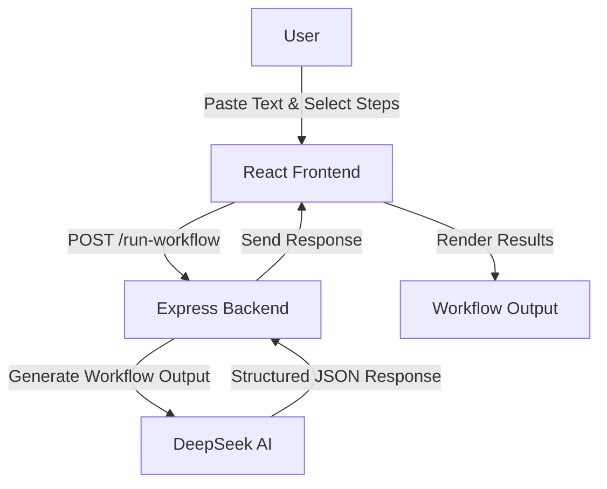

# DeepFlow – Workflow Builder

A lightweight workflow automation tool that allows you to run multiple AI-powered text-processing steps on input text, such as cleaning text, summarizing, extracting keywords, or tagging categories. DeepFlow integrates with **DeepSeek AI (DeepSeek-R1)** to intelligently process the text in a single call.

## 🔗 Live Links
- **Frontend:** https://deepflow-xi.vercel.app
- **Backend:** Hosted on Railway

## 🔹 What is DeepFlow?
```text
DeepFlow is designed for users who want to quickly analyze and process text in a customizable workflow. You can:

1. Paste any text.

2. Select 2–4 processing steps.

3. Run the workflow and get results for each step.

4. View the last 5 workflow runs in activity.
```
## 📖 How to Use 
```text
1. Paste your text in the input area.

2. Select 2–4 workflow steps from the options or select predefined templates(e.g., Clean Text, Summarize, Extract Keywords, Tag Category).

3. Click Run Workflow.

4. View results for each step and check the last 5 runs.
```
## ⚡ Features

- Selectable workflow steps (2–4 per run).

- Already given three predefined templates(quickSummary, deepAnalysis, fullProcessing).

- Single API call for multiple steps.

- Last 5 workflow runs stored in-memory.

- AI detection for “garbage” or non-analyzable text.

- Live backend and status page showing health.

## 🏗️ Basic Project Structure
```text
DeepFlow/
├── backend/
│   ├── server.js
│   ├── package.json
│   └── .env
│
├── frontend/
│   ├── src/
│   │   ├── App.jsx
│   │   └── components/
|   |       ├── HistoryModal.jsx
|   |       ├── StatusModal.jsx
│   │       ├── StepSelector.jsx
│   │       └── WorkflowOutput.jsx
│   └── package.json
│
└── README.md
```

## 🔄 System Flow Chart

This diagram represents the end-to-end lifecycle of a single analysis request:

## 🛠️ Tech Stack
```
Frontend: React.js, Vite  
Backend: Node.js, Express.js  
AI: DeepSeek (Model: DeepSeek-R1)
Database: MongoDB Atlas (not integrated yet) 
Deployment: Vercel (Frontend), Railway (Backend)  

```

## 💻 Local Setup & Installation
```
1. Clone the repository
git clone https://github.com/Ayan01456/deepflow
cd deepflow

2. Backend Setup
cd backend
npm install
Create a .env file with: OPENROUTER_API_KEY=your_key_here
Start server: node server.js

3. Frontend Setup
cd ../frontend
npm install
Create a .env file with: VITE_API_URL=http://localhost:5000
Start app: npm run dev

```
## ⚠️ Limitations

- Current workflow stores last 5 runs in-memory (without MongoDB integration).

- Only supports 2–4 steps per workflow.

- Step ordering validation is basic; AI suggestions are advisory.

- DeepSeek R1 is fast, but for larger texts, processing may take longer or experience delays.

- Input text is currently limited to ~300 words for reliable workflow execution.

- Text analysis accuracy depends on DeepSeek AI.


## 🔮 Improvements

- Integrate MongoDB Atlas for persistent workflow history.

- Add more workflow steps.

- Enhance AI suggestions for optimal step sequencing.

- Improve frontend UI/UX for mobile users.

- Experiment with faster LLM models to reduce response time.

- Add drag-and-drop reordering of steps for more flexibility.
